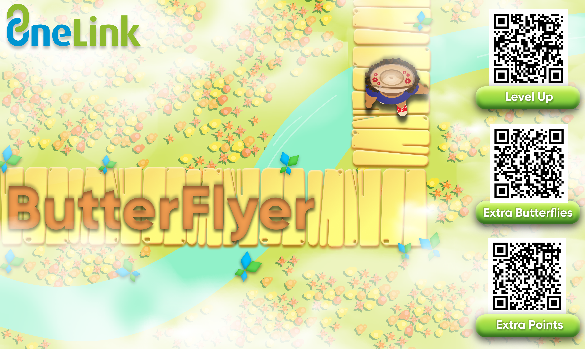

## Make It Your Own
### 1. Choose a custom package name(Android) or bundle identifier(iOS) 
To run and test this project locally, you'll need to change the package name/bundle identifier of the Unity project.

### 2. Create apps on Appsflyer account
Go to your AppsFlyer account and create an iOS or Android app(or both). Learn more [here](https://support.appsflyer.com/hc/en-us/articles/207377436-Adding-a-new-app#:~:text=Adding%20an%20app,click%20the%20Add%20app%20button).

### 3. Add your dev key to AppsFlyerObject
- Change the `Dev Key` to your key. 
- If you are using an iOS app, add the `App ID`. Else, do not change it.

### 4. Create a test template and link
- Create a  OneLink template. Learn more [here](https://support.appsflyer.com/hc/en-us/articles/208874366-OneLink-links-and-experiences).
- Create a new OneLink custom link.
- In the new link:
  - Set the `deep link value` to your desired start level(use `1` for the first level or `2` for the second level).
  - Under the *Additional Parameters* section, add a custom parameter name `deep_link_sub1` with the number of extra butterflies you want to gift the user.
  - Add another parameter name `deep_link_sub2` and set it to the number of extra points you want to gift the user.
### 5. Associated Domains
- Copy your template subdomain(with the extension `.onelink.me`). 
- For Android - paste it into the `AndroidManifest.xml` file android host. You can find it in `Assets/Plugins/Android/AndroidManifest.xml`. 
- For iOS - add the subdomain to the associated domains in Xcode before runing the app. Learn more [here](https://dev.appsflyer.com/hc/docs/initial-setup-2#enabling-associated-domains).

### 6. User Invite(optional)
Copy your custom template ID and paste it in the `Start()` method of the `AppsFlyerObjectScript` object. You can find the script in `Assets/AppsFlyer/AppsFlyerObjectScript.cs`.

### 7. Build your app and run it on your device
> We highly recommend running and testing your app on a real iOS or Android device(and not a simulated one).

### 8. Click your link, invite a friend and get the highest score! 
- Now that your app is running, click the link and see your DeepLink values under the **Referral Bonuses** window.
- You can invite a friend using the **Share** button, and generate your own link.
- Start playing our awesome game and share your highest score with friends.

